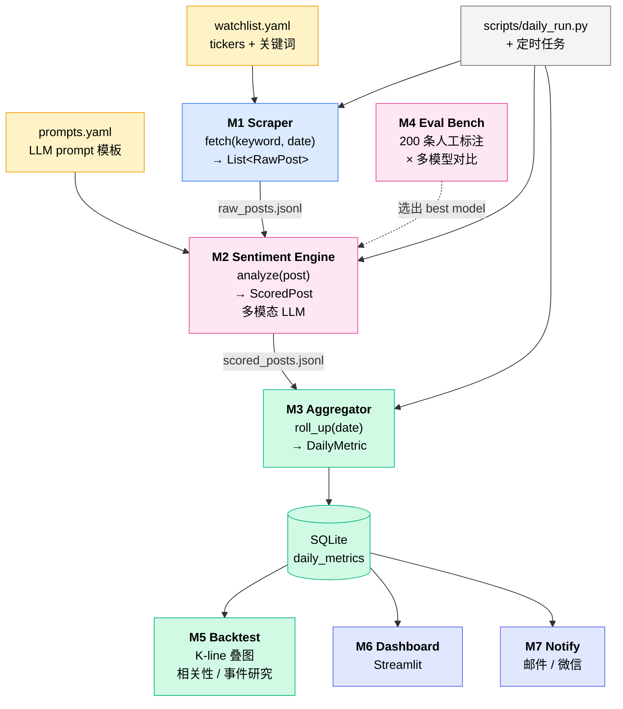

# rednote_monitor — 项目蓝图 v0.1

> 一句话:**对小红书上指定 ticker 的相关帖子进行多模态情绪打分,日度聚合输出"乐观/悲观"和"讨论量"两个指标,辅助人工交易决策。**

---

## 一、系统架构图



> 看不到图?把整段 `mermaid` 粘到 https://mermaid.live 即可。VS Code 装 Markdown Preview Mermaid Support 也行。

---

## 二、模块定义(7 个)

每个模块**只通过 JSON 文件或 SQLite 表**与其他模块通讯。这是多人协作的关键:**接口冻结后,内部实现各自玩**。

### M1 · Scraper(数据采集)
- **职责:** 给定 keyword + 日期,产出当日帖子 + 评论的 JSONL
- **接口:**
  ```python
  def fetch(keyword: str, date: date) -> List[RawPost]
  ```
- **输入:** `config/watchlist.yaml` 里的 keyword
- **输出文件:** `data/raw/{date}_{keyword}.jsonl`
- **实现方案(任选一个,但必须实现 ManualScraper 作为兜底):**
  - `ManualScraper`:读 `data/raw/manual/{date}_{keyword}.txt` —— **第一周必做,解锁所有下游模块**
  - `MediaCrawlerScraper`:包装开源项目 MediaCrawler
  - `SaasScraper`:对接千瓜 / 新榜 / 知微 API
- **预计工作量:** ManualScraper 0.5h;真 Scraper 3 天~不确定
- **不做:** 视频处理

### M2 · Sentiment Engine(情绪打分)
- **职责:** 单条帖子(含图)+ 评论区 → 结构化情绪打分
- **接口:**
  ```python
  def analyze(post: RawPost) -> ScoredPost
  ```
- **输入:** `data/raw/*.jsonl`
- **输出文件:** `data/scored/{date}_{keyword}.jsonl`
- **关键设计:**
  - **帖子主体和评论区分开打分**(常常情绪相反)
  - **多模态:** image 直接喂 vision model(Qwen-VL / GPT-4o / Claude),不做 OCR
  - polarity 五档: -2 / -1 / 0 / +1 / +2
  - 必须输出 `quote` 字段(LLM 抓的原句证据),用于人工审计
- **使用模型:** 由 M4 决定;开发期默认 mimo-v2.5-pro (小米 Token Plan, OpenAI 兼容格式)
- **预计工作量:** 2 天

### M3 · Aggregator + Storage(日度聚合)
- **职责:** 把每日 N 条帖子的 ScoredPost → 一条 DailyMetric,写入 SQLite
- **接口:**
  ```python
  def roll_up(date: date) -> List[DailyMetric]
  ```
- **输入:** `data/scored/*.jsonl`
- **输出:** SQLite 表 `daily_metrics`
- **聚合规则:**
  - `sentiment_post_avg`:用 `n_likes` 加权平均
  - `sentiment_comment_avg`:简单算术均值
  - `sentiment_combined`:`0.6 * post_avg + 0.4 * comment_avg`(权重可调)
  - `top_quotes`:挑 3-5 条信息量最大的引用
- **预计工作量:** 1 天

### M4 · Eval Bench(模型选型)
- **职责:** 在 200 条人工标注的小红书评论上,横向对比多模型准确率
- **接口:**
  ```python
  def evaluate(model: str, prompt_id: str) -> EvalReport
  ```
- **输入:** `data/eval/labeled_200.csv`(人工标注集)
- **输出:** `data/eval/results_{date}.csv` + markdown 报告
- **要测的模型:** Claude / GPT-4o / GPT-4o-mini / DeepSeek-V3 / Qwen-Max / Qwen2.5-7B(本地小模型作 baseline)
- **分维度统计准确率:** easy / medium / hard;反讽 / 小白口吻 / 普通
- **预计工作量:** 标注 2h + 跑测脚本 1 天

### M5 · Backtest(信号验证)
- **职责:** 读 SQLite 的情绪曲线 + 拉历史 K 线,叠图 + 算相关性
- **输入:** `daily_metrics` 表 + yfinance/akshare
- **输出:** `data/backtest/{ticker}_{run_date}.html` + 关键统计
- **不做:** 真实交易;只算 IC、分位事件研究、Granger 因果
- **预计工作量:** 2 天

### M6 · Dashboard(可视化)
- **职责:** Streamlit 页面,展示每个 ticker 的情绪曲线 + K 线 + 当日 top 引用
- **输入:** SQLite
- **预计工作量:** 1 天

### M7 · Notify(告警推送)
- **职责:** 当 `sentiment_combined` 突破历史 90 分位且持续 N 天,推送告警
- **推送渠道:** 邮件(SMTP)+ Server 酱(微信)
- **预计工作量:** 0.5 天

---

## 三、模块间数据契约

> 这是**最重要的部分**,改这里要全员同意。

### RawPost(M1 → M2)
```json
{
  "post_id": "65a3...",
  "keyword": "英伟达",
  "date": "2026-05-12",
  "author": "投资小白白",
  "text": "梭哈了生活费,等暴富改命",
  "image_urls": ["https://..."],
  "n_likes": 234,
  "n_comments_total": 87,
  "comments": [
    {"text": "勇士", "n_likes": 12},
    {"text": "韭菜本菜", "n_likes": 45}
  ]
}
```

### ScoredPost(M2 → M3)
```json
{
  "post_id": "65a3...",
  "keyword": "英伟达",
  "date": "2026-05-12",
  "is_relevant": true,
  "sentiment_post": 2,
  "comment_scores": [
    {"comment_id": "c1...", "sentiment": -2, "is_relevant": true},
    {"comment_id": "c2...", "sentiment":  1, "is_relevant": true},
    {"comment_id": "c3...", "sentiment":  0, "is_relevant": false}
  ],
  "n_comments_scored": 2,
  "sentiment_comments_avg": -0.83,
  "sentiment_comments_std": 1.41,
  "fomo": 9,
  "quote": "梭哈了生活费",
  "model": "gpt-4o-mini",
  "cost_usd": 0.0023
}
```

**字段说明(2026-05-13 修订):**
- `is_relevant`:**M2 必须输出**。watchlist 宽 keyword 会召回大量非投资语料(实测"机器人"约 50% 是产品演示/亲子手工/AI 招聘八卦)。M3 聚合时只把 `is_relevant=true` 的帖子计入 `n_posts` 和 sentiment_avg。
- **`comment_scores` 是评论区唯一可信来源**。LLM 只输出每条评论的 `sentiment + is_relevant`,**不输出评论区整体值**。M2 后处理在 `comment_scores` 上按 `n_likes` 加权得到 `sentiment_comments_avg`(连续 float),保留分布信号。这是 2026-05-13 用户校正过的设计:LLM 直接给整体 5 档枚举会把 38 条评论分布压垮。
- M2 实现方案(两选一):
  - **A · 逐条单独调:** 每条评论一次 LLM 调用。$0.004/帖 × 50 帖/天 × 4 标的 ≈ $0.8/天 (GPT-4o-mini)。反讽细节最稳。生产阶段可切 DeepSeek-V3 / Qwen-Max 砍 5-10x。
  - **B · 批量喂 + 强制结构化:** 单帖一次调用,要求 LLM 输出 `[{comment_id, sentiment, is_relevant}, ...]` 数组。成本 $0.002/帖,但需要 prompt 工程防 LLM 偷懒输出"整体感觉"。
  - 不能选"LLM 直接给整体值",这等于退化到单 5 档枚举,违背 ScoredPost 设计意图。
- `n_comments_scored` = `len([c for c in comment_scores if c.is_relevant])`,M4 评测要这个口径。
- `sentiment_comments_std` 可选,给 M3 算"共识 vs 撕裂"用。

### DailyMetric(M3 → SQLite)
```sql
CREATE TABLE daily_metrics (
  ticker TEXT,
  date DATE,
  n_posts INT,
  sentiment_post_avg REAL,
  sentiment_comment_avg REAL,
  sentiment_combined REAL,
  top_quotes_json TEXT,
  PRIMARY KEY (ticker, date)
);
```

---

## 四、团队分工建议

> Owner 一栏目前是占位 (A/B/C/D),**任一同学认领后请直接在本表填名字**,并把自己的 KPI 块抄到工位 / 屏幕便签。下面的「剩余任务速查」也请同步更新勾选状态。

### 3 人版

| 同学 | 模块 | 估时 |
|---|---|---|
| A | M1 Scraper + M7 Notify | 4-5 天 |
| B | M2 Sentiment + M4 Eval | 3-4 天 |
| C | M3 Aggregator + M5 Backtest + M6 Dashboard | 4-5 天 |

### 4 人版

| 同学 | 模块 |
|---|---|
| A | M1 Scraper |
| B | M2 Sentiment + M4 Eval |
| C | M3 Aggregator + M5 Backtest |
| D | M6 Dashboard + M7 Notify + 调度/打包 |

### 核心 KPI(每个 owner 的成败标准)

> 没有 KPI 的"分工"等于没分工。下面是每人 day-0 就该贴在屏幕上的成功定义。

- **A · 数据可用率:**
  - 4 标的每日产出 ≥ 40 条**相关** RawPost(`is_relevant=true` 经 M2 过滤后)
  - Scraper 断更时 12h 内降级到 ManualScraper,数据流不中断
  - keyword 噪声率监控:对每个 watchlist 跟踪 M2 标的 `is_relevant=false` 比例,>50% 就要调 keyword

- **B · 情绪识别准确率(本项目最硬的 KPI):**
  - `labeled_200` 上 sentiment 整体准确率 **≥ 75%**(混淆矩阵的对角线)
  - **反讽子集准确率 ≥ 70%**(单独抽出 30 条带反讽语料,这条不达标不能上线)
  - per-comment `is_relevant` 判别 F1 **≥ 0.85**(否则 A 拉的相关帖被错杀,n_posts 失真)
  - M2 单日 LLM 成本 **≤ $1/天/4 标的**(开发期 GPT-4o-mini,生产可切 DeepSeek 进一步降)
  - **M4 评测报告是 B 交付物,不是 nice-to-have** —— Week 2 末必须有一份多模型对比 markdown

- **C · 信号闭环:**
  - 每日产 DailyMetric × 4 标的并写入 SQLite,跑 30 天无断点
  - 90 天 backtest 出 IC + 分位事件研究图表(M5 输出)
  - Dashboard 能在 5 秒内打开,显示 1 张情绪曲线 + K 线叠图 + top 3 quotes

### 剩余任务速查(2026-05-13 进度快照)

> 已完成 ✅ / 待做 ⬜。以 **4 人版**为基础列;走 3 人版时把 D 桶并到 A/C 即可(见上表)。
> 「共享」桶是**任何 owner 都可以先动**的活,适合昨天 MVP 已经走过、还没找到归属的小尾巴。

#### 共享 / 起步先做(无固定 owner)
- ✅ BLUEPRINT.md / README.md / docs/architecture.png
- ✅ config/watchlist.yaml(只启用 oracle,其余 enabled=false)
- ✅ `src/models.py` 数据契约 + XHS payload 适配器
- ✅ `.mcp.json` 接入本机 xiaohongshu-mcp
- ⬜ **Owner 拍板**:把上方 § 四表里的 A/B/C/D 换成真实人名
- ⬜ `pyproject.toml` + `uv.lock` —— 缺它 `uv sync` 跑不通,README quick-start 第一步就挂

#### Owner A · M1 Scraper(+ M7 Notify,仅 3 人版)
- ✅ `src/scraper/base.py` Scraper Protocol
- ✅ `src/scraper/manual.py` ManualScraper + `dump_all()`
- ✅ xiaohongshu-mcp 真实拉数已 demo:4 watchlist search + oracle 1 帖 detail,产物在 `data/raw/manual/*.json` + `data/raw/2026-05-13_oracle.jsonl`
- ✅ 字段坑沉淀进 memory(filters DOM 不稳 / `int(post_id[:8],16)` = unix 秒 / 4 keyword 噪声差异)
- ⬜ `src/scraper/xhs_mcp.py`:把昨天手动跑过的 `search_feeds → 客户端按 hex 切日期 → get_feed_detail → 落 manual_dir` 固化成函数,**不要再每天靠 Claude 手敲 MCP**
- ⬜ `tests/scraper/test_xhs_mcp.py`:用 `data/raw/manual/test_20260513_*_search.json` 4 个文件作 fixture
- ⬜ keyword 噪声率监控:对 M2 反馈回来的 `is_relevant=false` 比例日志化,>50% 报警(对接 KPI § 四.A)
- ⬜ Scraper 断更降级到 ManualScraper 的自动切换逻辑(对接 § 八 风险 1)
- ⬜ **3 人版 only**:`src/notify/push.py` 邮件 SMTP + Server 酱

#### Owner B · M2 Sentiment + M4 Eval
- ⬜ `src/sentiment/engine.py` + `prompts.py`:httpx 直连 OpenAI 兼容 API,默认 mimo-v2.5-pro (小米 API)
- ⬜ 严格遵守 § 三 ScoredPost 设计:post / per-comment 分开打,LLM 只给离散值,`sentiment_comments_avg` 在客户端按 `n_likes` 加权得到(memory [[feedback-llm-outputs]] 已锁死)
- ⬜ 必须输出 `is_relevant` 门控(memory [[m1-field-findings]] 第 3 条:机器人 keyword 噪声率 ~50%)
- ⬜ M4 标注集 `data/eval/labeled_200.csv`(标 200 条,含 ≥30 条反讽子集)+ `scripts/label_helper.py` 半自动标注工具
- ⬜ `src/eval/run.py` 多模型评测脚本 + markdown 报告(Week 2 末交付物,不是 nice-to-have)
- ⬜ KPI 周报自动化:每周跑一次评测,准确率/反讽/F1/单日成本四项任一不达标立刻报警

#### Owner C · M3 Aggregator + M5 Backtest(+ M6 Dashboard,仅 3 人版)
- ⬜ `src/aggregate/daily.py`:sqlmodel + SQLite,写 `daily_metrics` 表
- ⬜ 聚合规则:post_avg 按 `n_likes` 加权 / comment_avg 算术 / `sentiment_combined = 0.6*post + 0.4*comment` / top_quotes 挑 3-5 条
- ⬜ **只 count `is_relevant=true` 的帖子进 `n_posts`** —— 否则机器人 ETF 讨论会被亲子手工帖糊掉
- ⬜ `scripts/daily_run.py --date YYYY-MM-DD` 串 M1→M2→M3
- ⬜ M5 backtest:`src/backtest/{kline,overlay}.py`,yfinance(US/HK)+ akshare(A股),90 天 IC + 分位事件研究
- ⬜ **3 人版 only**:`app/dashboard.py` Streamlit(情绪曲线 + K 线叠图 + top 3 quotes)

#### Owner D · M6 Dashboard + M7 Notify + 调度/打包(仅 4 人版)
- ⬜ `app/dashboard.py` Streamlit dashboard
- ⬜ `src/notify/push.py` SMTP + Server 酱;触发条件 = `sentiment_combined` 突破历史 90 分位且持续 N 天
- ⬜ `pyproject.toml` + `uv.lock` + ruff/mypy 配置 + Windows Task Scheduler / GitHub Actions 定时跑
- ⬜ CI lint(BLUEPRINT § 五 Week 1 那条)

---

### 协作原则
1. **谁负责模块,谁写它的单元测试**(至少跑通 happy path)
2. **接口字段任何改动**,改前必须发群里同步;`src/models.py` 是高频冲突点
3. **每个模块第一版强制走 mock data**——A 没出 Scraper 的时候,B/C/D 用 `data/raw/manual/*` 里的样例数据正常开发
4. **每周一次合并演示**:每人 5 分钟,跑一遍自己模块的 demo
5. **KPI 对账机制:** 每周演示同步贴一次"这周 KPI 完成度",B 的准确率走低必须立刻报警(可能是 prompt 改坏了 / 模型版本切换)

---

## 五、构建顺序(里程碑)

### Week 1:打通端到端骨架(用最丑版本)
- [ ] 项目骨架 + `pyproject.toml` + CI lint  ← **挡所有人,先做**
- [x] `watchlist.yaml` 定下监控的 3-5 个标的(只启用 oracle 做最小测试)
- [x] M1 `ManualScraper` 已实现,xiaohongshu-mcp 真实拉数已 demo,样本落 `data/raw/manual/`
- [ ] M2 用 GPT-4o-mini 跑通,输出 `ScoredPost`
- [ ] M3 写入 SQLite
- [ ] 一条命令 `python scripts/daily_run.py --date 2026-05-13` 跑通全流程
- **里程碑:能看到数据库里有一行 DailyMetric**

### Week 2:三条线并行
- [ ] M1 接入真实数据源(MediaCrawler 或 SaaS)
- [ ] M4 标 200 条 + 跑多模型 → 选定 Sentiment Engine 默认模型
- [ ] M6 Streamlit dashboard 雏形

### Week 3:验证 + 上线
- [ ] M5 Backtest:挑 1-2 只标的,跑 90 天历史回测
- [ ] M7 Notify 接 Server 酱
- [ ] 部署到一台机器(本地 / 服务器 / GitHub Actions),每日定时跑

---

## 六、技术栈(都是 vibe-coding 友好的选择)

| 用途 | 选择 | 原因 |
|---|---|---|
| 包管理 | `uv` | 快 |
| 数据校验 | `pydantic` | RawPost / ScoredPost 全用它 |
| 存储 | `sqlmodel` (SQLite) | 小项目够用,迁移轻 |
| LLM 多模型调用 | `httpx` + OpenAI 兼容 API | 直连小米 API / SiliconFlow / OpenRouter 等,M4 可切换模型 |
| 多模态 | OpenAI SDK / Anthropic SDK | 直接支持 image |
| K 线 | `yfinance`(美/Crypto)+ `akshare`(A股) | 免费 |
| 调度 | Windows Task Scheduler / GitHub Actions | 别上 Airflow |
| 推送 | SMTP + Server 酱 | 免费 |
| Dashboard | `streamlit` | 半天上手 |
| Scraper | `MediaCrawler`(GitHub 现成) | 别自己写 |

---

## 七、目录结构

```
rednote_monitor/
├── BLUEPRINT.md                  # 你正在看的这个
├── README.md
├── pyproject.toml
├── config/
│   ├── watchlist.yaml
│   └── prompts.yaml
├── data/
│   ├── raw/
│   │   ├── manual/               # M1 兜底:手动复制评论
│   │   └── *.jsonl
│   ├── scored/
│   ├── eval/
│   │   ├── labeled_200.csv       # M4 人工标注集
│   │   └── results_*.csv
│   ├── backtest/
│   └── monitor.db                # SQLite
├── src/
│   ├── scraper/
│   │   ├── base.py
│   │   ├── manual.py
│   │   ├── mediacrawler.py
│   │   └── saas.py
│   ├── sentiment/
│   │   ├── engine.py
│   │   └── prompts.py
│   ├── aggregate/
│   │   └── daily.py
│   ├── eval/
│   │   └── run.py
│   ├── backtest/
│   │   ├── kline.py
│   │   └── overlay.py
│   ├── notify/
│   │   └── push.py
│   └── models.py                 # 所有 pydantic 数据契约
├── app/
│   └── dashboard.py              # Streamlit
├── scripts/
│   ├── daily_run.py              # 调度入口
│   └── label_helper.py           # 标 200 条评论的小工具
└── tests/
    └── test_*.py                 # 每个模块至少一个 happy path
```

---

## 八、风险与已知坑

1. **小红书反爬地狱级:** M1 无论选哪个方案都会断更。**对策:** ManualScraper 永远保留,真 Scraper 挂掉时降级到人工 30 分钟/天
2. **情绪不对称:** XHS 上熊市时大家"装死",采不到悲观情绪。**对策:** v1 只用作"顶部预警",不指望预测底
3. **LLM 反讽识别翻车:** 必须靠 M4 兜底,选出在反讽子集上 > 70% 准确率的模型才上线
4. **多人协作分支冲突:** `src/models.py` 是高频冲突点,改前**必须**群里 +1
5. **关键词字面歧义(2026-05-13 实测):** 宽 keyword 在 publish_time filter 下会触发字面相关性扩召(`甲骨文`→古文字学习,`机器人`→亲子手工)。**对策:** scraper 调用只传 `sort_by=最新`,不传 publish_time;时间窗在客户端用 `int(post_id[:8], 16)` 切

---

## 九、换机迁移手册

> H 盘整盘搬到新电脑 / 重装系统时,30 分钟内恢复开发状态。

### 9.1 老机备份(否则丢东西)

| 项 | 路径 |
|---|---|
| Claude Code 用户数据(memory + 历史) | `C:\Users\<你>\.claude\` |
| Git 全局配置 | `C:\Users\<你>\.gitconfig` |
| SSH 私钥 | `C:\Users\<你>\.ssh\` |
| `.env`(API key,已 gitignore) | 项目里 |

一行打包:
```powershell
$dest = "H:\.backup_migration"
New-Item -ItemType Directory -Force -Path $dest | Out-Null
Compress-Archive -Path "$env:USERPROFILE\.claude" -DestinationPath "$dest\claude.zip" -Force
Copy-Item "$env:USERPROFILE\.gitconfig" "$dest\" -ErrorAction SilentlyContinue
Copy-Item "$env:USERPROFILE\.ssh" "$dest\ssh\" -Recurse -ErrorAction SilentlyContinue
```

### 9.2 新机装基础工具

| 工具 | 命令 |
|---|---|
| Git for Windows | https://git-scm.com/downloads |
| Python 3.13 | `winget install Python.Python.3.13` |
| uv | `powershell -c "irm https://astral.sh/uv/install.ps1 \| iex"` |
| Node.js LTS | `winget install OpenJS.NodeJS.LTS` |
| Claude Code | https://claude.com/claude-code |

### 9.3 还原配置

```powershell
Expand-Archive "H:\.backup_migration\claude.zip" -DestinationPath "$env:USERPROFILE\" -Force
Copy-Item "H:\.backup_migration\.gitconfig" "$env:USERPROFILE\" -ErrorAction SilentlyContinue
Copy-Item "H:\.backup_migration\ssh\*" "$env:USERPROFILE\.ssh\" -Recurse -ErrorAction SilentlyContinue
```

**关键:** 因为盘符 `H:` 没变,memory 文件不用动 —— Claude 进入项目自动 pick up `~/.claude/projects/H--project-rednote-monitor/memory/`。

### 9.4 项目首次启动

```powershell
cd H:\project\rednote_monitor

# (1) Python 依赖
uv sync

# (2) API key — 重设环境变量 / 改 .env
#     OPENAI_API_KEY / DEEPSEEK_API_KEY / ANTHROPIC_API_KEY / SERVERCHAN_KEY

# (3) xiaohongshu-mcp 重新扫码(老机 cookies 大概率失效,XHS 按设备指纹校验)
cd external\xiaohongshu-mcp
.\xiaohongshu-login-windows-amd64.exe          # 扫码
.\xiaohongshu-mcp-windows-amd64.exe            # 启 MCP @ :18060

# (4) 验证
#     启 Claude Code → /mcp 看到 xiaohongshu connected = ok
```

### 9.5 常见坑

| 现象 | 原因 / 处理 |
|---|---|
| memory 找不回 | `~/.claude/projects/H--project-rednote-monitor/memory/` 不存在 → zip 还原漏了,重做 9.3 |
| xiaohongshu-mcp 扫码后被踢 | 该账号同时在网页端登录了别处,退掉网页登录 |
| 盘符变了(H → D / E) | 项目里硬编码 `H:\...` 路径全失效。**预防:** 配置全用相对路径;**补救:** `subst H: D:\project\...` 映射回 |
| Playwright 一直下不动 | `$env:PLAYWRIGHT_DOWNLOAD_HOST = "https://npmmirror.com/mirrors/playwright"` |
| git push 权限错 | SSH key 没还原,`ssh -T git@github.com` 测,缺则重做 9.1 + 9.3 |

---

## 十、v2 backlog

> v1 跑稳后(≥ 30 天数据)才开 v2。三条方向 —— 作者级反指建模 / 多源 cross-check / 模型蒸馏 —— 详见 [`docs/v2_backlog.md`](./docs/v2_backlog.md)。

---

*最后更新:2026-05-13 · 维护者:lele*
