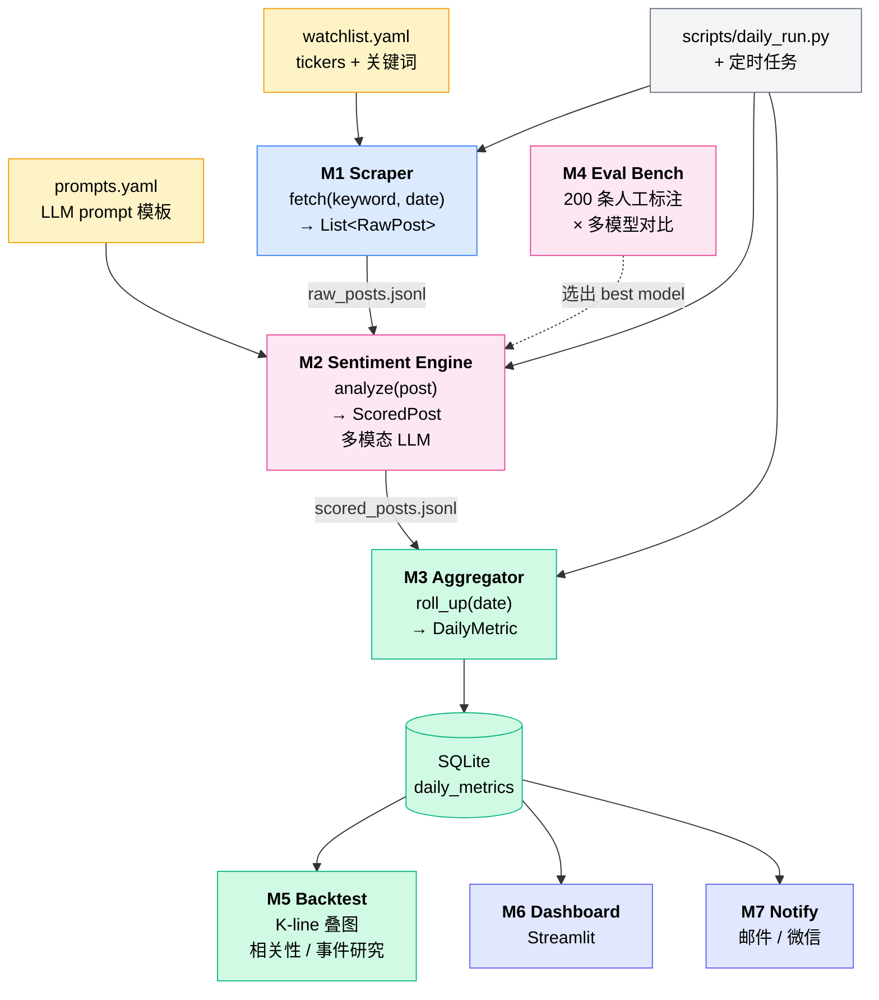

# rednote_monitor — 项目蓝图 v0.1

> 一句话:**对小红书上指定 ticker 的相关帖子进行多模态情绪打分,日度聚合输出"乐观/悲观"和"讨论量"两个指标,辅助人工交易决策。**

---

## 一、系统架构图



> 看不到图?把整段 `mermaid` 粘到 https://mermaid.live 即可。VS Code 装 Markdown Preview Mermaid Support 也行。

---

## 二、模块定义(7 个)

模块之间只走 JSON 文件或 SQLite,不互相 import。接口冻结后内部怎么写都不会影响别人,这是 7 个模块能并行排期的前提。

### M1 · Scraper(数据采集)
- **职责:** 给定 keyword + 日期,产出当日帖子 + 评论的 JSONL
- **接口:**
  ```python
  def fetch(keyword: str, date: date) -> List[RawPost]
  ```
- **输入:** `config/watchlist.yaml` 里的 keyword
- **输出文件:** `data/raw/{date}_{keyword}.jsonl`
- **实现方案(任选一个,但必须实现 ManualScraper 作为兜底):**
  - `ManualScraper`:读 `data/raw/manual/{date}_{keyword}.txt` —— **第一周必做,解锁所有下游模块**
  - `MediaCrawlerScraper`:包装开源项目 MediaCrawler
  - `SaasScraper`:对接千瓜 / 新榜 / 知微 API
- **预计工作量:** ManualScraper 0.5h;真 Scraper 3 天~不确定
- **不做:** 视频处理

### M2 · Sentiment Engine(情绪打分)
- **职责:** 单条帖子(含图)+ 评论区 → 结构化情绪打分
- **接口:**
  ```python
  def analyze(post: RawPost) -> ScoredPost
  ```
- **输入:** `data/raw/*.jsonl`
- **输出文件:** `data/scored/{date}_{keyword}.jsonl`
- **关键设计:**
  - **帖子主体和评论区分开打分**(常常情绪相反)
  - **多模态:** image 直接喂 vision model(Qwen-VL / GPT-4o / Claude),不做 OCR
  - polarity 五档: -2 / -1 / 0 / +1 / +2
  - 必须输出 `quote` 字段(LLM 抓的原句证据),用于人工审计
- **使用模型:** 由 M4 决定;开发期默认 GPT-4o-mini
- **预计工作量:** 2 天

### M3 · Aggregator + Storage(日度聚合)
- **职责:** 把每日 N 条帖子的 ScoredPost → 一条 DailyMetric,写入 SQLite
- **接口:**
  ```python
  def roll_up(date: date) -> List[DailyMetric]
  ```
- **输入:** `data/scored/*.jsonl`
- **输出:** SQLite 表 `daily_metrics`
- **聚合规则:**
  - `sentiment_post_avg`:用 `n_likes` 加权平均
  - `sentiment_comment_avg`:简单算术均值
  - `sentiment_combined`:`0.6 * post_avg + 0.4 * comment_avg`(权重可调)
  - `top_quotes`:挑 3-5 条信息量最大的引用
- **预计工作量:** 1 天

### M4 · Eval Bench(模型选型)
- **职责:** 在 200 条人工标注的小红书评论上,横向对比多模型准确率
- **接口:**
  ```python
  def evaluate(model: str, prompt_id: str) -> EvalReport
  ```
- **输入:** `data/eval/labeled_200.csv`(人工标注集)
- **输出:** `data/eval/results_{date}.csv` + markdown 报告
- **要测的模型:** Claude / GPT-4o / GPT-4o-mini / DeepSeek-V3 / Qwen-Max / Qwen2.5-7B(本地小模型作 baseline)
- **分维度统计准确率:** easy / medium / hard;反讽 / 小白口吻 / 普通
- **预计工作量:** 标注 2h + 跑测脚本 1 天

### M5 · Backtest(信号验证)
- **职责:** 读 SQLite 的情绪曲线 + 拉历史 K 线,叠图 + 算相关性
- **输入:** `daily_metrics` 表 + yfinance/akshare
- **输出:** `data/backtest/{ticker}_{run_date}.html` + 关键统计
- **不做:** 真实交易;只算 IC、分位事件研究、Granger 因果
- **预计工作量:** 2 天

### M6 · Dashboard(可视化)
- **职责:** Streamlit 页面,展示每个 ticker 的情绪曲线 + K 线 + 当日 top 引用
- **输入:** SQLite
- **预计工作量:** 1 天

### M7 · Notify(告警推送)
- **职责:** 当 `sentiment_combined` 突破历史 90 分位且持续 N 天,推送告警
- **推送渠道:** 邮件(SMTP)+ Server 酱(微信)
- **预计工作量:** 0.5 天

---

## 三、模块间数据契约

> 这是**最重要的部分**,改这里要全员同意。

### RawPost(M1 → M2)
```json
{
  "post_id": "65a3...",
  "keyword": "英伟达",
  "date": "2026-05-12",
  "author": "投资小白白",
  "text": "梭哈了生活费,等暴富改命",
  "image_urls": ["https://..."],
  "n_likes": 234,
  "n_comments_total": 87,
  "comments": [
    {"text": "勇士", "n_likes": 12},
    {"text": "韭菜本菜", "n_likes": 45}
  ]
}
```

### ScoredPost(M2 → M3)
```json
{
  "post_id": "65a3...",
  "keyword": "英伟达",
  "date": "2026-05-12",
  "is_relevant": true,
  "sentiment_post": 2,
  "comment_scores": [
    {"comment_id": "c1...", "sentiment": -2, "is_relevant": true},
    {"comment_id": "c2...", "sentiment":  1, "is_relevant": true},
    {"comment_id": "c3...", "sentiment":  0, "is_relevant": false}
  ],
  "n_comments_scored": 2,
  "sentiment_comments_avg": -0.83,
  "sentiment_comments_std": 1.41,
  "fomo": 9,
  "quote": "梭哈了生活费",
  "model": "gpt-4o-mini",
  "cost_usd": 0.0023
}
```

**字段说明(2026-05-13 修订):**
- `is_relevant`:**M2 必须输出**。watchlist 宽 keyword 会召回大量非投资语料(实测"机器人"约 50% 是产品演示/亲子手工/AI 招聘八卦)。M3 聚合时只把 `is_relevant=true` 的帖子计入 `n_posts` 和 sentiment_avg。
- **`comment_scores` 是评论区唯一可信来源**。LLM 只输出每条评论的 `sentiment + is_relevant`,**不输出评论区整体值**。M2 后处理在 `comment_scores` 上按 `n_likes` 加权得到 `sentiment_comments_avg`(连续 float),保留分布信号。这是 2026-05-13 用户校正过的设计:LLM 直接给整体 5 档枚举会把 38 条评论分布压垮。
- M2 实现方案(两选一):
  - **A · 逐条单独调:** 每条评论一次 LLM 调用。$0.004/帖 × 50 帖/天 × 4 标的 ≈ $0.8/天 (GPT-4o-mini)。反讽细节最稳。生产阶段可切 DeepSeek-V3 / Qwen-Max 砍 5-10x。
  - **B · 批量喂 + 强制结构化:** 单帖一次调用,要求 LLM 输出 `[{comment_id, sentiment, is_relevant}, ...]` 数组。成本 $0.002/帖,但需要 prompt 工程防 LLM 偷懒输出"整体感觉"。
  - 不能选"LLM 直接给整体值",这等于退化到单 5 档枚举,违背 ScoredPost 设计意图。
- `n_comments_scored` = `len([c for c in comment_scores if c.is_relevant])`,M4 评测要这个口径。
- `sentiment_comments_std` 可选,给 M3 算"共识 vs 撕裂"用。

### DailyMetric(M3 → SQLite)
```sql
CREATE TABLE daily_metrics (
  ticker TEXT,
  date DATE,
  n_posts INT,
  sentiment_post_avg REAL,
  sentiment_comment_avg REAL,
  sentiment_combined REAL,
  top_quotes_json TEXT,
  PRIMARY KEY (ticker, date)
);
```

---

## 四、分工

当前 3 人:LSM, QBW, LELE。按模块功能内聚分 4 块,谁接哪块视具体经验和兴趣定,不固定姓名映射。

### 4 块结构

**M1 · Scraper**
反爬 / xiaohongshu-mcp 维护 / Scraper 断更降级。工程活,跟下游 LLM 异质,单独切出来。

**M2 + M3 + M4 · 打分质量闭环**
改 prompt(M2)→ 看聚合结果(M3)→ 评测(M4)→ 回头调 prompt,反馈链在一个人手里最快。Week 1-2 最重的活在这里。

**M5 · Backtest**
拉 K 线 + 算 IC + 分位事件研究。金融 + 统计活,跟 LLM 工程异质,单独切出来。

**M6 + M7 · 输出端**
Dashboard 和 Notify 都是消费 SQLite 的下游,共享 `daily_metrics` 输入,绑一起合理。工作量都小。

### KPI(贴自己屏幕用)

**M1**
- 4 标的每天产 ≥ 40 条相关 RawPost(过 M2 的 `is_relevant` 过滤后)
- Scraper 断更 12h 内自动降级到 ManualScraper
- 每个 watchlist 的 `is_relevant=false` 比例 > 50% 就要调 keyword

**M2 + M3 + M4**
- labeled_200 上整体准确率 ≥ 75%
- 反讽子集 ≥ 70%(单独抽 30 条,不达标不上线)
- per-comment `is_relevant` F1 ≥ 0.85
- M2 单日 LLM 成本 ≤ $1/天(开发期 GPT-4o-mini,生产可切 DeepSeek)
- M4 评测 markdown 报告 Week 2 末出
- 每日产 4 行 DailyMetric 入库,跑 30 天无断点

**M5**
- 至少 1 只标的跑通 90 天 IC + 事件研究
- v1 阶段只做"顶部预警",不预测底

**M6 + M7**
- Dashboard 5 秒内打开,情绪曲线 + K 线 + top 3 quotes
- 告警 90 分位,不漏推、24h 不重推

### 当前进度(2026-05-13)

已搭好:BLUEPRINT / README / docs 几份文档 / `config/watchlist.yaml`(只开 oracle) / `src/models.py` 全套数据契约 + XHS payload 适配器 / `src/scraper/{base, manual}.py` / xiaohongshu-mcp 真实拉数 demo + 4 keyword 探查样本(`data/raw/manual/`) / `.mcp.json`。filters DOM 不稳 / feed_id hex 时间戳 / 4 keyword 噪声差异这几个坑沉淀进 memory。

还没动:`pyproject.toml`(挡所有人,先做)/ 把昨天手动的 MCP 调用固化成 `src/scraper/xhs_mcp.py` / 整个 M2-M7。

### 各块剩余清单

**M1:**
- `src/scraper/xhs_mcp.py` — 把昨天手动跑过的 `search → 客户端按 hex 切日期 → get_feed_detail → 落 manual_dir`,封装成函数,别再每天靠 Claude 手敲 MCP
- `tests/scraper/test_xhs_mcp.py` — 用 `data/raw/manual/test_20260513_*_search.json` 4 个文件作 fixture

**M2 + M3 + M4:**
- `src/sentiment/engine.py` + `prompts.yaml` — litellm 多模型,默认 GPT-4o-mini;post / per-comment 分开打,LLM 只给离散值,客户端按 `n_likes` 加权聚合(细节见 § 三)
- M2 必须输出 `is_relevant` 门控(机器人 keyword 噪声 ~50%,没这门控 M3 直接糊)
- `src/aggregate/daily.py` + `scripts/daily_run.py` — 写 SQLite,聚合时只 count `is_relevant=true` 的帖子进 `n_posts`
- 标 200 条到 `data/eval/labeled_200.csv`,含 ≥ 30 条反讽子集
- `scripts/label_helper.py` 标注小工具
- `src/eval/run.py` 多模型评测脚本 + markdown 报告(Week 2 末)

**M5:**
- `src/backtest/{kline, overlay}.py` — yfinance + akshare 拉 K 线,先拿 oracle 跑通 90 天 IC + 事件研究

**M6 + M7:**
- `app/dashboard.py` Streamlit
- `src/notify/push.py` SMTP + Server 酱
- 定时调度(Windows Task Scheduler 或 GitHub Actions)
- `pyproject.toml` + `uv.lock` + ruff(项目骨架,接 M6+M7 的人顺手做,挡所有人)

---

### 协作几条

1. 谁的模块,谁写测试(至少 happy path)
2. 改核心受保护文件(`models.py` / `prompts.yaml` / `watchlist.yaml` / `daily_run.py`)前先群里 +1,走 PR + CODEOWNERS。详细流程见 `docs/collab_guide.md`
3. 模块第一版用 mock data 跑通,不要等 partnerA 出 RawPost 再开始 —— `data/raw/manual/` 里已经有样本可以塞
4. 每周一次演示,5 分钟一人,跑自己模块的 happy path
5. 周演示同步对一次 KPI,任一项走低先报警(可能 prompt 改坏了 / 模型版本切了)

---

## 五、构建顺序(里程碑)

### Week 1:打通端到端骨架(用最丑版本)
- [ ] 项目骨架 + `pyproject.toml` + CI lint  ← **挡所有人,先做**
- [x] `watchlist.yaml` 定下监控的 3-5 个标的(只启用 oracle 做最小测试)
- [x] M1 `ManualScraper` 已实现,xiaohongshu-mcp 真实拉数已 demo,样本落 `data/raw/manual/`
- [ ] M2 用 GPT-4o-mini 跑通,输出 `ScoredPost`
- [ ] M3 写入 SQLite
- [ ] 一条命令 `python scripts/daily_run.py --date 2026-05-13` 跑通全流程
- **里程碑:能看到数据库里有一行 DailyMetric**

### Week 2:三条线并行
- [ ] M1 接入真实数据源(MediaCrawler 或 SaaS)
- [ ] M4 标 200 条 + 跑多模型 → 选定 Sentiment Engine 默认模型
- [ ] M6 Streamlit dashboard 雏形

### Week 3:验证 + 上线
- [ ] M5 Backtest:挑 1-2 只标的,跑 90 天历史回测
- [ ] M7 Notify 接 Server 酱
- [ ] 部署到一台机器(本地 / 服务器 / GitHub Actions),每日定时跑

---

## 六、技术栈(都是 vibe-coding 友好的选择)

| 用途 | 选择 | 原因 |
|---|---|---|
| 包管理 | `uv` | 快 |
| 数据校验 | `pydantic` | RawPost / ScoredPost 全用它 |
| 存储 | `sqlmodel` (SQLite) | 小项目够用,迁移轻 |
| LLM 多模型调用 | `litellm` | 一套代码切多家,M4 必备 |
| 多模态 | OpenAI SDK / Anthropic SDK | 直接支持 image |
| K 线 | `yfinance`(美/Crypto)+ `akshare`(A股) | 免费 |
| 调度 | Windows Task Scheduler / GitHub Actions | 别上 Airflow |
| 推送 | SMTP + Server 酱 | 免费 |
| Dashboard | `streamlit` | 半天上手 |
| Scraper | `MediaCrawler`(GitHub 现成) | 别自己写 |

---

## 七、目录结构

```
rednote_monitor/
├── BLUEPRINT.md                  # 你正在看的这个
├── README.md
├── pyproject.toml
├── config/
│   ├── watchlist.yaml
│   └── prompts.yaml
├── data/
│   ├── raw/
│   │   ├── manual/               # M1 兜底:手动复制评论
│   │   └── *.jsonl
│   ├── scored/
│   ├── eval/
│   │   ├── labeled_200.csv       # M4 人工标注集
│   │   └── results_*.csv
│   ├── backtest/
│   └── monitor.db                # SQLite
├── src/
│   ├── scraper/
│   │   ├── base.py
│   │   ├── manual.py
│   │   ├── mediacrawler.py
│   │   └── saas.py
│   ├── sentiment/
│   │   ├── engine.py
│   │   └── prompts.py
│   ├── aggregate/
│   │   └── daily.py
│   ├── eval/
│   │   └── run.py
│   ├── backtest/
│   │   ├── kline.py
│   │   └── overlay.py
│   ├── notify/
│   │   └── push.py
│   └── models.py                 # 所有 pydantic 数据契约
├── app/
│   └── dashboard.py              # Streamlit
├── scripts/
│   ├── daily_run.py              # 调度入口
│   └── label_helper.py           # 标 200 条评论的小工具
└── tests/
    └── test_*.py                 # 每个模块至少一个 happy path
```

---

## 八、风险与已知坑

1. **小红书反爬地狱级:** M1 无论选哪个方案都会断更。**对策:** ManualScraper 永远保留,真 Scraper 挂掉时降级到人工 30 分钟/天
2. **情绪不对称:** XHS 上熊市时大家"装死",采不到悲观情绪。**对策:** v1 只用作"顶部预警",不指望预测底
3. **LLM 反讽识别翻车:** 必须靠 M4 兜底,选出在反讽子集上 > 70% 准确率的模型才上线
4. **多人协作分支冲突:** `src/models.py` 是高频冲突点,改前**必须**群里 +1
5. **关键词字面歧义(2026-05-13 实测):** 宽 keyword 在 publish_time filter 下会触发字面相关性扩召(`甲骨文`→古文字学习,`机器人`→亲子手工)。**对策:** scraper 调用只传 `sort_by=最新`,不传 publish_time;时间窗在客户端用 `int(post_id[:8], 16)` 切

---

## 九、v2 backlog

> v1 跑稳后(≥ 30 天数据)才开 v2。三条方向 —— 作者级反指建模 / 多源 cross-check / 模型蒸馏 —— 详见 [`docs/v2_backlog.md`](./docs/v2_backlog.md)。

---

*最后更新:2026-05-13 · 维护者:lele*
